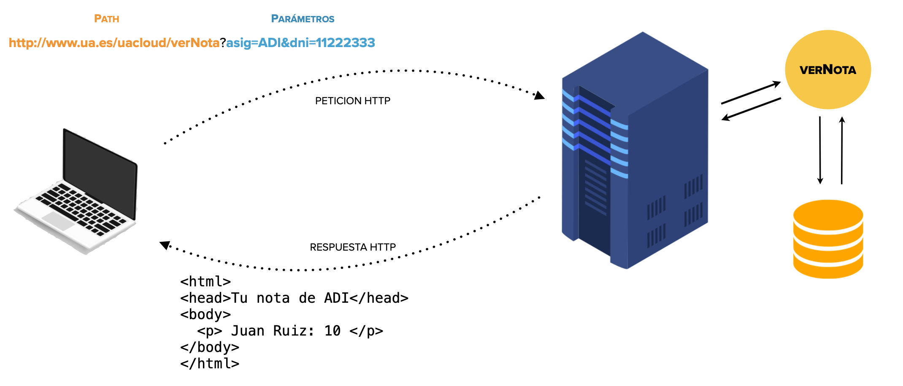
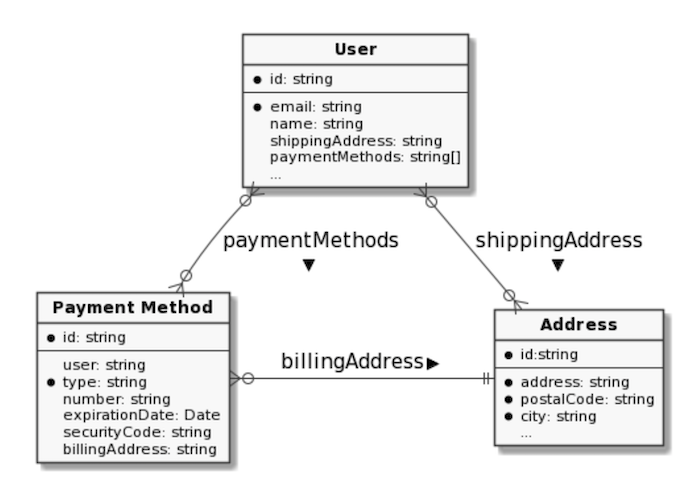
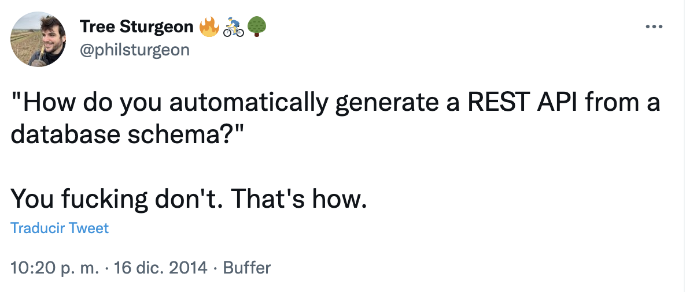

<!-- .slide: class="titulo" -->

# Tema 1
## Diseño y desarrollo de APIs REST
### (Sesión 1)

---

## Contenidos


1. Tipos de APIs web: RPC vs REST
2. Introducción a los APIs REST
3. Recursos y relaciones entre ellos
4. Métodos
5. Granularidad de los recursos


---

## API


- La interfaz de un sistema destinada al programador, no al usuario final
- [Librería estándar de C++](https://en.cppreference.com/w/cpp/standard_library), [API Collections de Java](https://docs.oracle.com/javase/10/docs/api/java/util/doc-files/coll-overview.html)
- A nosotros nos interesan las APIs Web ya que son las que necesitamos para construir aplicaciones web 

---

## Aplicaciones web "clásicas"


 <!-- .element class="stretch" -->


---

## APIS web de tipo RPC


- Podemos considerar la petición/respuesta HTTP en una app web clásica como una llamada a un API remoto
- Por eso estos APIs se denominan RPCs (o Remote Procedure Calls)
- El **concepto central** es la **operación a realizar** (`verNota`, `ponerNota`, `listarAlumnos`,...).
- Nótese que en cada aplicación las operaciones serán distintas (`recogerCoche`, `devolverCoche` en una agencia de alquiler de coches,...)


---

¡ Pero en HTTP ya existe un conjunto de **operaciones estándar**, correspondiente a algunos **métodos HTTP** (GET, POST, PATCH, PUT, DELETE), **que valen para todo** (leer, crear, actualizar, borrar), no necesitamos operaciones *ad hoc*!


---

<!-- .slide: class="titulo" -->

## 2. Introducción rápida a los APIs REST

---

## APIs REST

- Si ya tenemos operaciones universales que valen para cualquier dominio, el concepto central de cada API no debería ser la operación sino los **objetos** con los que operamos
- El término común en este contexto no es objetos sino **recursos**

---

## Elementos importantes en un API REST

- Las URLs (== los recursos)
- Los métodos HTTP (==las operaciones)
- El código de estado (==el resultado de la operación) 
- El formato de los datos que intercambian servidor y cliente (típicamente JSON)


---

## Las URLs

- Cada recurso debe tener una URL única que lo identifique

```javascript
//esta URL es de un API ficticio
http://api.ua.es/asignaturas/34039
//Esta no, es del API de Github
https://api.github.com/users/ottocol
```

---

## Los métodos

Una URL por sí sola no sirve para mucho salvo que digamos qué hacer con el recurso, lo que se consigue haciendo una petición HTTP a la URL con el método HTTP apropiado (GET, POST, PATCH, PUT, DELETE)

> En la web "clásica" solamente se usaban GET y POST, aunque en HTTP también se definían desde el comienzo PUT y DELETE, era imposible lanzar una petición de estos tipos desde el navegador.

---

## El código de estado

- En REST el código de estado devuelto por el servidor es importante, ya que indica qué ha pasado con la operación

```c
  //Convenciones similares se usan en otros lenguajes/contextos
  int main() {
      ...
      return 0; //En web esto es 200 OK 
  }
```

- https://httpstatuses.com/


---

## El formato de datos

HTML no es muy apropiado para datos en general, ya que está diseñado para representar documentos

```html
<html>
    <head>Tu nota de ADI</head>
    <body>
      <h1>Tu nota:</h1>
      <p>Juan Ruiz:10</p>
    </body>
</html>

```

---

## El formato de datos (II)

Una alternativa usada inicialmente en APIs web fue XML, pero bueno 😑

```xml
<?xml version="1.0" encoding="UTF-8" standalone="no" ?>
<nota>
  <alumno>
     Juan Ruiz
  </alumno>
  <valor>
     10
  </valor>
</nota>
```

---

## El formato de datos (III)

Actualmente se tiende a usar por defecto JSON en todos los APIs

```json
{
  "alumno": "Juan Ruiz",
  "nota": 10 
}

```
 <!-- .element class="stretch" -->

---


## REST formalmente

Tiene su origen en [la tesis](www.ics.uci.edu/~fielding/pubs/dissertation/top.htm) de [Roy Fielding](https://twitter.com/fielding),e implica 6 condiciones:

*   Cliente-servidor
*   Interfaz uniforme
    *   Identificación de los recursos
    *   Representaciones estándar
    *   Mensajes auto-descriptivos
    *   Hypermedia as The Engine of The Application State (HATEOAS)
*   Sin estado
*   Cacheable
*   Capas (proxys de modo transparente)
*   Código "bajo demanda" (opcional)

 <!-- .element: class="right_vertical_center" -->

---

<!-- .slide: class="titulo" -->

## 3. Recursos y relaciones entre ellos

---

- El **recurso** es el concepto central en los APIs REST
- No solo tendremos recursos, sino también **relaciones** entre ellos

Figura tomada de [API design patterns, JJ Geewax](https://www.manning.com/books/api-design-patterns) 
<!--  .element: class="caption" --> 

 <!-- .element: class="r-stretch"· -->

> No existe un "tipo de diagrama estándar" para APIs REST, aquí usaremos *diagramas E-R* simplemente porque estáis familiarizados con ellos, pero  `API REST != Base de Datos`

---

Nos falta saber "cómo pasar esto a URLs"


---

## Colecciones (varios recursos)

- Representan todos los recursos de un tipo. Por convención, **en plural**

```bash
https://api.github.com/users
https://api.github.com/repos
https://api.linkedin.com/v1/people
```

> Seguramente no tiene sentido práctico acceder a **todos** los usuarios, repos,... (¡son muchos!). Ya veremos cómo *filtrar* colecciones

---

## Identificador (un único recurso)

- Cada recurso individual debe tener un identificador único 
- Para que sea sencillo saber el tipo, el identificador se precede de la colección a la que pertenece

```bash
https://api.github.com/users/octocat
```

---

## Relación jerárquica: subrecursos


- Hay relaciones que expresan **pertenencia** (los repositorios de un usuario, los comentarios de un post en un blog) - Si borramos el lado del 1 el lado N no tiene sentido
- En la URL lo podemos representar al estilo "subdirectorio" (subrecursos)

```bash
# Un usuario tiene N repos
https://api.github.com/users/octocat/repos
# Un repo tiene N issues
https://api.github.com/repos/octocat/Hello-World/issues
```

> Nótese que en el último ejemplo el *path* debería ser `https://api.github.com/users/octocat/repos/Hello-World/issues` pero si tenemos una jerarquía muy profunda y nos empeñamos en trasladarla literalmente a URLs, al final serán inmanejables


---

## Relación de "referencia"

- En ocasiones una relación referencia a otro recurso sin expresar "propiedad"
- Ejemplo: en un inventario de una empresa los objetos dentro de una sala
- Mejor que usar URL jerárquicas (`sala/1/objetos/`) para GET/POST/PUT/DELETE  podemos hacer que el JSON del recurso contenga una *"clave ajena"*

```bash
Petición: POST /objetos
Cuerpo: {
  nombre: "proyector 4K",
  idSala: 1
}
```

- nada nos impide seguir usando una URL jerárquica para GET


---

## Relación "muchos a muchos"

- Es muy típico crear un recurso "adicional" que expresa la relación (igual que en BD relacionales se usa una *"join table"*)
- Ejemplo: asignaturas<->alumnos -> matriculaciones

```bash
Petición: POST /matriculaciones
Cuerpo: {
  idMatriculacion: 1291232,
  idAsignatura: 34039,
  idAlumno: 666
}
```
- Nada nos impide tener además URLs del tipo `/asignaturas/34039/alumnos` o `alumnos/666/asignaturas` para GET

---

## ¡Cuidado! el API no es la Base de datos

- Hemos usado un esquema ER por ser una notación sencilla y que conocemos y lo mismo con la terminología de BD ("clave ajena", "join table", ...) pero eso **no quiere decir que este sea el esquema de la BD**
- Los recursos deben estar estructurados según las **necesidades de los usuarios**, los de la BD según las necesidades internas de la compañía y la tecnología de BD usada
- En cierto momento se "puso de moda" generar un API REST automáticamente a partir de la BD , pero no es una práctica aconsejable

---


 <!-- .element class="stretch" -->

---

## Recursos estructurados según las necesidades de los usuarios

- Por ejemplo, el API de Github incluye algunos datos sobre el **propietario** cuando accedemos a un **repositorio** ([https://api.github.com/repos/octocat/Hello-World](https://api.github.com/repos/octocat/Hello-World), mirad el campo "owner"), el de Spotify incluye bastantes datos sobre las **pistas** al obtener  un **album**,...
- Si en Spotify usan una BD relacional dudo que guarden los datos de las pistas dentro de los datos del album

---

<!-- .slide: class="titulo" -->

## 4. Operaciones


---

Hasta ahora sabemos cómo referenciar un recurso, pero nos falta otra parte igualmente importante, **¿Qué queremos HACER con él??**

Recordemos que en APIs REST solo hay 4 operaciones estándar, que son siempre las mismas en todos los APIs: crear, leer, actualizar y borrar (CRUD)

---

A continuación para cada una de las 4 operaciones veremos:

- Cómo será la petición HTTP
  + Qué método HTTP debemos usar
  + Qué cabeceras hacen falta (si hace falta alguna)
- Qué devolverá el servidor como respuesta
  + En el código de estado 
  + En las cabeceras
  + En el cuerpo de la respuesta 
  + Evidentemente la respuesta dependerá de las circunstancias (p.ej borramos un recurso OK / intentamos borrar uno que no existe)

---

## Leer recurso: petición

- **Método** GET
- Normalmente no hacen falta cabeceras HTTP

> Para probar peticiones GET simplemente podemos escribir la URL del recurso en la barra de direcciones del navegador. En línea de comandos podemos usar por ejemplo la herramienta `curl` (Unix/Linux)

```bash
# si no tienes instalado curl puedes probarlo en https://replit.com/@ottocol/GET-Github-API
# el -i nos muestra el status code y las cabeceras del servidor
curl -i https://api.github.com/users/octocat
```

---


## Leer recurso: respuesta

- **Algunos estados** posibles: **200** (OK, se devuelve el recurso), **404** (el recurso con dicho `id` no existe),  **401** (credenciales incorrectas), **500** (Error del servidor, p.ej. se ha caído la BD)
- La cabecera `Content-Type` especifica el tipo MIME del formato de los datos

```http
200 OK
Content-Type:application/json

{
  "login": "octocat",
  "id": 583231,
  "avatar_url": "https://avatars.githubusercontent.com/u/583231?v=3",
  ...
}
```

---

## Crear recurso: petición

Típicamente la URL es la de la colección de recursos, ya que el nuevo recurso todavía no tiene un `id` (normalmente lo asigna el servidor)

```bash
# "user" es el usuario autentificado en la llamada al API
# luego veremos cómo nos autentificamos
https://api.github.com/user/repos
```

- El método debe ser **POST** 
- Se debe enviar el nuevo recurso en el cuerpo de la petición
- Se debe enviar la cabecera `Content-Type` con el tipo de datos

---

## Ejemplo de POST en el API de Github

> Normalmente para crear recursos hay que autentificarse, ya veremos con más detalle métodos de autentificación en APIs REST. En el caso del API de Github hace falta un *token de acceso* personal ([cómo generarlo](https://docs.github.com/en/github/authenticating-to-github/keeping-your-account-and-data-secure/creating-a-personal-access-token))

```bash
# Cómo enviar la petición usando la herramienta "curl"
# CAMBIAR "mi_usuario_de_github" por el vuestro
curl -v -H "Content-Type: application/json" \
  -X POST \
  -u "mi_usuario_de_github"  \
  -d '{"name":"NuevoRepo","description":"Repo de prueba"}' \
  https://api.github.com/user/repos 
```
Podéis probarlo en [https://replit.com/@ottocol/pruebaPOSTgithub](https://replit.com/@ottocol/pruebaPOSTgithub) (cambiar en el `main.sh` el usuario por el vuestro de github y darle al botón "run", os pedirá un password que en realidad será el *personal access token*) 
<!-- .element: class="caption" -->

---


## Crear recurso: respuesta

- **Estados** posibles: **201** (Recurso creado correctamente), **401** (sin autentificar o credenciales incorrectas), **403** (no tienes permiso para esta operación) **400** (petición incorrecta, p.ej. falta un campo o su valor no es válido), **500** (Error del servidor, p.ej. se ha caído la BD)
- En caso de **201** Lo más RESTful es **devolver la URL del recurso creado** en la cabecera HTTP `Location` de la respuesta

```http
201 CREATED HTTP/1.1
Location: https://api.github.com/repos/octocat/Hello-World
```

---

## Actualizar recurso: petición y respuesta

- **URL** del recurso ya existente
- Método HTTP **PUT**
- **Nuevos datos**: según la ortodoxia REST, actualizar significaría enviar TODOS los datos del recurso, incluso los que no cambian.
- **PATCH**: cambiar solo ciertos datos. No es tan conocido como PUT al ser una adición más reciente a HTTP.
- **Resultados posibles**:  **204** (Recurso modificado correctamente, no hay nada que añadir :) ), **404** (recurso no existente), Errores ya vistos con POST (**400**, **401**, **500**, ...)

---

## Eliminar recurso: petición y respuesta

-   URL del recurso a eliminar
-   Método **DELETE**
-   **Resultados posibles**:
    *   204 (Recurso eliminado correctamente, nada que añadir)
    *   Errores ya vistos (400, 401, 403, 404, 500, ...)

   Tras ejecutar el DELETE con éxito, las siguientes peticiones GET a la URL del recurso deberían devolver 404


---

<!-- .slide: class="titulo" -->

## 5. Granularidad de los recursos


---

## El problema de la granularidad de los recursos

Supongamos un recurso con subrecursos, por ejemplo los *posts* de un blog con sus comentarios. 

```http
GET http://miapificticiodeblogs.com/blogs/1/posts
```

¿qué hacemos con los subrecursos?

- ¿Si el cliente los necesita, que los solicite aparte?
- ¿Los devolvemos junto con el recurso principal?

---

## Opción 1: "Ignorar" los subrecursos

Si el cliente necesita habitualmente los subrecursos junto con el recurso principal tenemos un [problema de tipo "N+1"](https://www.infoq.com/articles/N-Plus-1)

- 1 petición para listar el recurso principal (p.ej. los datos básicos de cada post: título, texto )
- N peticiones para solicitar la lista de subrecursos para cada instancia del principal (los comentarios de cada post)

---

## Opción 2: Subrecursos "embebidos"

Si el caso de uso más habitual es necesitar los subrecursos junto con el recurso "principal" podemos incluirlos en la respuesta

```javascript
[
  { "id": 1,
  "titulo": "Bienvenidos a mi blog",
  "comentarios": [
     {"id": 1, "texto": "primero en comentar!!"},
     {"id": 5, "texto": "los blogs se han pasado de moda..."}
  ]}
  {"id":2,
    ... }
]
```

Problema: si en algún caso no los necesitamos, malgastamos ancho de banda. 

---

## Granularidad de los recursos en REST

Como podemos ver, el problema es que **la granularidad de los recursos en REST es fija**, no hay ningún mecanismo de *query* para poder decir qué datos de un recurso o qué subrecursos queremos y cuáles no

---


En general, **no hay una solución siempre mejor**. La solución apropiada la determinarán los casos de uso típicos del API

Por ejemplo, el API de Github incluye algunos datos sobre el **propietario** [cuando accedemos a un **repositorio**](https://api.github.com/repos/ottocol/ADI_2122), pero sin embargo no lista los repos cuando accedemos a un **usuario** (solo devuelve el número de repos públicos)

Otro ejemplo de que **las peticiones al API no tienen por qué reflejar la estructura de la BD subyacente**


---

## Algunas extensiones "no estándar" a REST para solucionar esto

Para controlar qué información queremos obtener

- Especificar los subrecursos que queremos obtener
- Seleccionar solo algunos datos del recurso (respuestas parciales)
- Recuperar varios recursos simultáneamente

---

## Especificar subrecursos a obtener

```bash
# Esta sintaxis es propia del Graph API de Facebook
# junto con el usuario autentificado obtenemos sus últimas 5 fotos y sus últimos 5 posts
https://graph.facebook.com/me?fields=photos.limit(5),posts.limit(5)
```

Esta idea llevada "al extremo" nos lleva a otros "paradigmas" de diseño de APIs como GraphQL, que ya veremos

---

## Respuestas parciales

- Muchas veces un recurso contiene **campos que no necesitamos**, ya que en REST "estándar" siempre se obtiene la **representación completa** del recurso
- Algunos APIs "un poco más allá" de REST permiten seleccionar **solo los campos que necesitamos**.

```bash
# Sintaxis propia del Grah API de Facebook
https://graph.facebook.com/JustinBieber?fields=id,name,picture
# No creo que Justin Bieber esté en linkedin pero la sintaxis es real y propia de linkedin
https://api.linkedin.com/v1/people/JustinBieber:(id,num-connections,picture-url)
```

> La URL de ejemplo del graph API de FB no os funcionará a menos que tengáis un *token* de autentificación (lo veremos en sesiones posteriores)

---

## Recuperar varios recursos a la vez

Algunos APIs permiten recuperar varios recursos en una sola petición a partir de sus `id`, reduciendo así el número de peticiones.

Ejemplo: en el API de Spotify se puede obtener información de varios álbumes con una sola petición pasando como parámetro HTTP una lista de `ids` separados por comas

```bash
# Simplificación, los ids reales son mucho más largos
https://api.spotify.com/v1/albums?ids=111Ab31,2GFg2222,3333Tg7f
# Nótese que el "endpoint" para un solo álbum sabiendo su id es distinto al anterior
https://api.spotify.com/v1/album/111Ab31
```

---

## Referencia complementaria 
### (para saber más, si os interesa el tema)

**API design patterns, JJ Geewax**. Disponible en la UA a través de O`Reilly: [https://learning.oreilly.com/library/view/api-design-patterns/9781617295850/](https://learning.oreilly.com/library/view/api-design-patterns/9781617295850/) 


 <!-- .element class="stretch" -->


