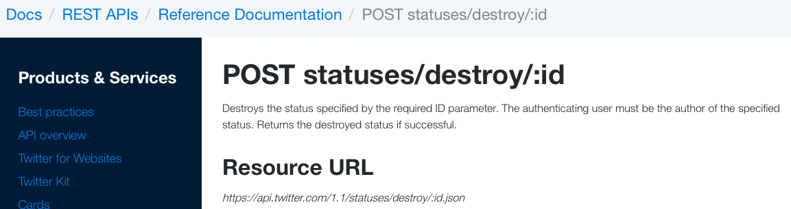
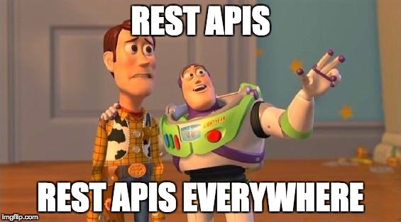
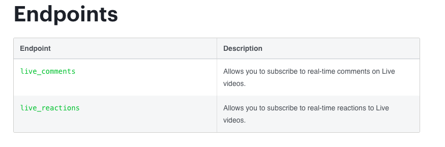
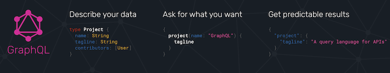

<!-- .slide: class="titulo" -->

# Tema 2
## Diseño y desarrollo de APIs REST
### (sesión 2)


---


## Contenidos de hoy

4. **Colecciones: filtrados, búsquedas y paginación**
5. Buenas prácticas en el diseño de APIs REST
6. Buenas prácticas a nivel técnico
7. Más allá de REST

---

## Filtrar colecciones

- Es poco habitual obtener **todos** los elementos de un tipo, es más común
  + Filtrar resultados especificando condiciones
  + Paginar los resultados, limitando así su número
- Ambos casos se suelen representar con una *query string* (grupo de parámetros HTTP precedido de `?`)

```http
http://mislibros.com/libros?titulo_contiene=tronos&autor_contiene=Martin
https://graph.facebook.com/JustinBieber/photos?offset=5&limit=2
https://api.github.com/users/octocat/repos?page=2&per_page=5
```


---

En algunos APIs como el de Github, la búsqueda se hace mediante URLs especiales

```bash
# buscar todos los repositorios con la palabra clave "node"
https://api.github.com/search/repositories?q=node
```

Esto no es nada REST (¡Un verbo en una URL!), pero qué le vamos a hacer, se ve por ahí

---

## Paginación basada en offset

- Suponiendo que los resultados están ordenados, especificamos la *cantidad* deseada y el *offset* (a partir de qué dato queremos)
- Los parámetros son propios de cada API (`page`&`per_page`, `page`&`count`, `offset`&`limit`...) normalmente el significado es fácil de deducir por el nombre

```http
https://gateway.marvel.com:443/v1/public/characters?limit=10&offset=0
```

- La respuesta suele contener **metadatos** con página actual, total, etc.

```javascript
{   "offset": 0,
    "limit": 10,
    "total": 1491,
    "count": 10,
    "results": [
      {
        "id": 1011334,
        "name": "3-D Man",
        "description": "",
        "modified": "2014-04-29T14:18:17-0400",
        "thumbnail": {
          "path": "http://i.annihil.us/u/prod/marvel/i/mg/c/e0/535fecbbb9784",
          "extension": "jpg"
        }
        ...
      }
        ...
      ]
}
```

---

## Problemas de la paginación por offset

- En SQL, las consultas con un *offset* grande son ineficientes (la BD tiene que leer y descartar las filas)
- En datos que puedan cambiar en tiempo real, añadir/eliminar datos puede significar que se dupliquen/eliminen resultados


---

## Paginación con cursores

- Inicialmente el cliente pide solo una cantidad de datos. En la respuesta viene un **cursor**: identificador único que marca un dato concreto de la lista. 
- En cada respuesta se envía generalmente un cursor para ir "atrás" y otro para "adelante"

```json
{
  "data": [
     ... aquí estarían los datos en sí de lo que hemos pedido
  ],
  "paging": {
    "cursors": {
      "after": "MTAxNTExOTQ1MjAwNzI5NDE=",
      "before": "NDMyNzQyODI3OTQw"
    },
    "previous": "https://graph.facebook.com/me/albums?limit=25&before=NDMyNzQyODI3OTQw",
    "next": "https://graph.facebook.com/me/albums?limit=25&after=MTAxNTExOTQ1MjAwNzI5NDE="
  }
}
```

Problema: el cliente no puede saltar a una página concreta, solo ir adelante y atrás


---

En cuanto a la **implementación** el cursor puede ser un *timestamp*, un *id* o similar, que permita ordenar e indexar los datos y que nos asegure de que no van a aparecer datos nuevos "por enmedio"

Ejemplo: algunos *endpoint* del graph API de FB usan *timestamp* UNIX con los parámetros `since` o `until`

```http
https://graph.facebook.com/me/feed?limit=25&since=1364849754"
```

Cursores "opacos": internamente pueden ser *timestamp*, *id* o lo que sea (combinación de ambos, p.ej.) pero al cliente no le importa. Además evita que el cliente "haga trampas" usando valores "inventados" para los cursores

```http
https://graph.facebook.com/me/albums?limit=25&after=MTAxNTExOTQ1MjAwNzI5NDE=
```

---

<!-- .slide: class="titulo" -->
# 5. Buenas prácticas en el diseño de APIs REST


---

## Algunas buenas prácticas

Primero: los usuarios del API son los **desarrolladores** que van a implementar *apps* o webs que llamen al API, no los usuarios finales de las *apps* o de las webs

- **Consistencia** en el diseño del API, no "sorprender" al usuario
- Centrarse en los **casos de uso**
- **Formalizar la API** antes de implementarla (diseño por contrato, *design first*)

Así especificadas son aplicables al diseño de cualquier tipo de API, no solo REST

---

## No sorprender al usuario

Seguir en lo posible las **convenciones estándar** (en nuestro caso, REST)

Pregunta: ¿Qué convenciones REST **no** se están respetando en esta llamada al API "REST" de Twitter que borra un tweet dado su *id*?



De la [documentación del API de Twitter](https://dev.twitter.com/rest/reference)
<!-- .element: class="caption" -->


---

El objetivo no es ser puristas REST ([Restafarians](https://www.ben-morris.com/the-restafarian-flame-wars-common-points-of-disagreement-over-rest-api-design/)) solo por esnobismo, es para facilitar la vida a los usuarios del API


---

## Centrarse en los casos de uso

El API debe **facilitar los casos de uso típicos**, no ser un reflejo del funcionamiento interno del sistema, ni de la base de datos


---

## Especificación formal de APIs REST

Existen varios lenguajes especialmente creados para **especificar APIs REST** que en general nos permiten:

- Obtener la especificación formal antes de implementar
- Generar automáticamente un servidor *mock* a partir de la especificación
- Validar automáticamente que la implementación cumple con la especificación
- Generar un esqueleto de implementación para servidor o cliente 
- Documentar automáticamente el API si ya está implementado

---

## Algunos lenguajes de especificación

<div class="row clearfix">
    <div class="column third">
      
      <a href="https://apiblueprint.org/" class="caption">API Blueprint]</a>
    </div>
    <div class="column third">
       
      <a href="https://swagger.io/" class="caption">OpenAPI/Swagger</a>
    </div>
    <div class="column third">
         
      <a href="https://raml.org/" class="caption">RAML</a>
      <a href="http://static-anypoint-mulesoft-com.s3.amazonaws.com/API_examples_notebooks/raml-design3.html" class="caption">Ejemplo de API</a>
      </div>
</div>


---

## Ejemplo con API Blueprint

```markdown
FORMAT: 1A

# Lista de la compra

API muy sencillo para manejar una lista de la compra

# Group Items

Los productos que hay en la lista de la compra

## Lista de Items [/items]

### Listar todos los items [GET]
+ Response 200 (application/json)

        [ 
           {"nombre":"Patatas", "cantidad":"1kg"},
           {"nombre":"leche", "cantidad":"1L"}
        ]

### Añadir item [POST]

+ Request (application/json)

        {"nombre":"vino", "cantidad":"1 botella"}
        
+ Response 201 (application/json)

    + Headers

            Location: /items/1
```

Hay [muchas herramientas](https://apiblueprint.org/tools.html) que trabajan con este formato, por ejemplo [https://getsandbox.com/](https://getsandbox.com/)

---


<!-- .slide: class="titulo" -->

# 6. Buenas prácticas a nivel técnico

---

## Versionar el API

- Si las URL se mantienen igual entre versiones del API pero cambiamos su comportamiento, "romperemos" los clientes
- Necesitamos que el cliente pueda **especificar a qué versión del API está llamando**

Solución 1: "incrustar" el número de versión en la URL

```http
https://graph.facebook.com/v2.5/me
https://api.twitter.com/1.1/search/tweets.json
```

Solución 2: (Ortodoxia REST): el cliente envía la cabecera `Accept` indicando qué versión del API quiere. Usada por ejemplo por el API de Github

```http
//con esto indicamos que queremos usar la versión 3 del API y queremos JSON
Accept: application/vnd.github.v3+json
```

---

## Cómo generar los id de los recursos

- **Autonuméricos** de la BD. Solución sencilla, pero puede dar problemas si tenemos más de un servidor de BD para repartir la carga (*shard*)
- **UUIDS**: podemos "asegurar" que son únicos aunque se generen desde distintas instancias de servidor

```javascript
//https://repl.it/LQjU
var uuid = require('uuid/v1')
console.log(uuid())   //176c8ba0-9cb6-11e7-abab-7df31ea5be22
```

---

## "Negociación" de contenido

- Hace unos años, todos los APIs devolvían solo XML, ahora casi todos usan solo JSON


- Si queremos que nuestro API admita y sirva varios formatos de datos, se considera una buena práctica que cliente y servidor puedan "**negociar**" el formato más adecuado para ambos


---

## Cómo negociar el formato según la ortodoxia REST

- Cliente -> servidor: cabecera `Accept` en la petición
```http
Accept: application/json;q=1.0, application/xml;q=0.5, */*;q=0.0
```

- Servidor -> cliente: 
  - Si no se han podido satisfacer las preferencias, código de estado `406 NOT ACCEPTABLE`
  - Indica el formato que ha enviado con la cabecera `Content-Type`

---

## Cómo se negocia el formato en el "mundo real"

Depende del API, en algunos se hace con **parámetros HTTP**, en otros es **parte de la URL** (generalmente como si fuera una extensión de archivo: `.xml`, `.json`,...)


```http
https://api.twitter.com/1.1/search/tweets.json
https://api.flickr.com/services?format=XML...
```


---

<!-- .slide: class="titulo" -->

# 7. Más allá de REST

 <!-- .element: class="r-stretch" -->


---

Aunque REST es el paradigma dominante en APIs web, hay casos en los que probablemente no sea el más apropiado:

- APIs orientados a **operaciones**
- *Streaming* de información, datos en **tiempo real**
-  Cuando necesitemos **flexibilidad** en los datos que queremos recuperar

---

## APIs orientados a operaciones

- No hay nada malo en que las primitivas básicas de un API sean las operaciones y no los recursos
- Este tipo de APIs se denominan genéricamente RPC (Remote Procedure Call)
- Por ejemplo el [API de Flickr](https://www.flickr.com/services/api/)  es RPC: aunque antes la documentación hablaba de REST y está agrupado por recursos como `contacts`, `favorites`, `galleries`,... las primitivas son operaciones

---


- En ciertos casos queremos estar al tanto de las **actualizaciones del servidor** (p. ej. un *juego online*, un *chat* ...)
- Con un API REST el cliente puede hacer ***polling* periódicamente, pero es ineficiente**, es mejor **que el servidor "nos avise"** de que hay nuevos datos

 <!-- .element: class="r-stretch" -->

De [Polling vs SSE vs WebSocket— How to choose the right one](https://codeburst.io/polling-vs-sse-vs-websocket-how-to-choose-the-right-one-1859e4e13bd9)
<!-- .element class="caption" --> 

---

## Algunas tecnologías web para tiempo real/eventos

**de Servidor a Cliente(Navegador)**

- **Long polling**: el cliente hace *polling* pero la conexión se mantiene abierta hasta que el servidor envía datos. Entonces hay que hacer *polling* de nuevo
- **Server Sent Events**: el cliente recibe de forma asíncrona mensajes y eventos del servidor
- **Websockets**: comunicación bidireccional asíncrona basada en eventos
- **Notificaciones push**: el navegador recibe notificaciones que muestra automáticamente (las veremos en la parte de móviles)

**de Servidor a Servidor**

- **Webhooks**: se avisa con una petición HTTP cuando hay nuevos datos 


---

## Ejemplo de tecnología: Server Sent Events


 + **Unidireccionales**, siempre desde el servidor al cliente
 + Mensajes de **texto**
 + Funciona sobre **HTTP**
 + [Amplio soporte](https://caniuse.com/#feat=eventsource) en navegadores actuales (en Edge debe ser una versión reciente)

---

## Ejemplo de código con SSE

Ejemplo completo en [https://glitch.com/edit/#!/peridot-coin](https://glitch.com/edit/#!/peridot-coin)
<!-- .element  class="caption"--> 

```javascript
//Servidor
app.get('/sse', function(pet, resp) {
  //El servidor de eventos debe usar el tipo MIME text/event-stream
  resp.header('Content-Type', 'text/event-stream')
  //Temporizador cada dos segundos
  setInterval(function() {
     //nombre del evento
     resp.write('event: ping\n')
     //datos del evento (texto, en nuestro caso un JSON)
     resp.write(`data: {"timestamp":"${new Date()}"}`)
     //Hay que acabar el mensaje con 2 retornos de carro
     resp.write('\n\n')
  }, 2000)
})

```

```javascript
//Cliente
var evtSource = new EventSource("/sse");
evtSource.addEventListener('ping', function(evento) {
   var datos = JSON.parse(evento.data)
   console.log(datos.timestamp)
})
```

---

Facebook ofrece algunos *endpoints* SSE en su "graph API"

[https://developers.facebook.com/docs/graph-api/server-sent-events](https://developers.facebook.com/docs/graph-api/server-sent-events)



---

## Flexibilidad al recuperar información

Ya vimos que un problema de REST es que **la granularidad de los recursos es fija**

```http
http://miapirest.com/blogs/1/posts/1
```
Queremos ver el post 1 del blog 1<!-- .element class="caption" -->

El diseñador del API puede haber decidido que un post ya incluye los comentarios, o bien que no, pero es una *decisión fija*. Si a veces los necesitamos y otras no, tendremos un problema.   


---

## Posible solución: GraphQL

- **GraphQL** es un lenguaje para hacer consultas flexibles a **APIs orientados a recursos** en los que estos están relacionados entre sí formando un **grafo**
- Desarrollado en Facebook, la especificación es *open source* (aunque controlada por FB): [https://github.com/facebook/graphql](https://github.com/facebook/graphql)
- Hay [multitud de implementaciones](http://graphql.org/code/) de cliente y servidor en diferentes lenguajes

 <!-- .element: class="r-stretch" -->

---

<!-- .slide: class="dim" -->
<!-- .slide: data-background-image="img_2/minions.jpg" -->
<!-- .slide: style="color: white; text-shadow: 1px 1px 3px black" -->
## Demo con el API GraphQL de Github

- [GraphQL Explorer](https://developer.github.com/v4/explorer/) (hace falta *estar logueado* en Github, todas las llamadas requieren autenticación)

- [Documentación](https://docs.github.com/en/free-pro-team@latest/graphql)

- [Otros APIs GraphQL de acceso público](https://github.com/apis-guru/graphql-apis)

---


## Referencias


**API design patterns, JJ Geewax**. Disponible en la UA a través de O`Reilly: [https://learning.oreilly.com/library/view/api-design-patterns/9781617295850/](https://learning.oreilly.com/library/view/api-design-patterns/9781617295850/) 


 <!-- .element class="stretch" -->


---

<!-- .slide: class="titulo" -->

# ¿Alguna duda?


